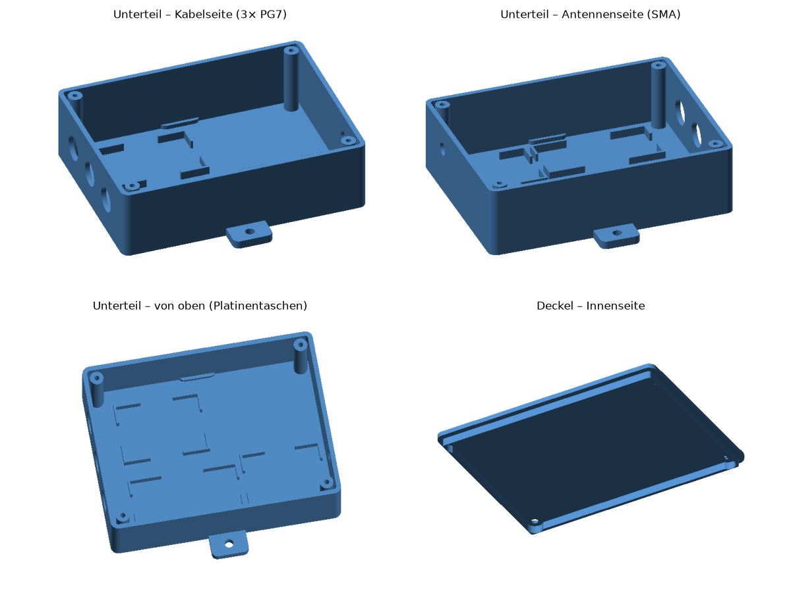
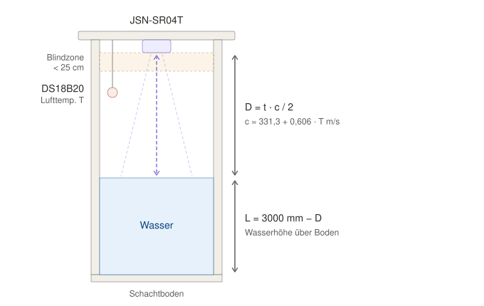
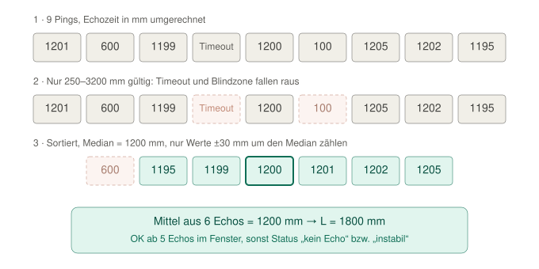
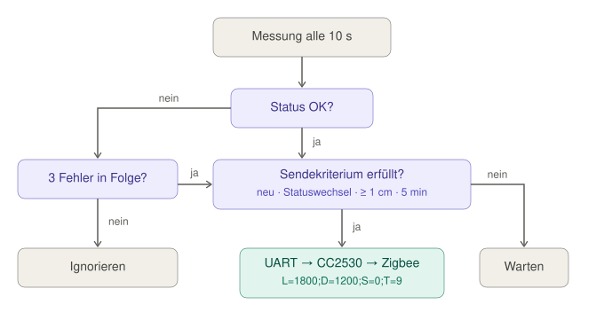

# wasserhoehe

Misst die Wasserhöhe in einem ca. 3 m tiefen Brunnenschacht per Ultraschall und schickt den Wert über Zigbee an Home Assistant (Zigbee2MQTT).

```
JSN-SR04T ──► STM32F103 (Bluepill) ──UART──► CC2530 (PTVO-Firmware) ──Zigbee──► Zigbee2MQTT ──► Home Assistant
```

## Hardware

| Teil | Aufgabe |
|---|---|
| JSN-SR04T (wasserdicht) | Abstand Sensor → Wasseroberfläche, 25–450 cm |
| STM32F103C8T6 Bluepill | Messung, Filterung, Sendelogik |
| TENSTAR CC2530 | Zigbee-Router mit [PTVO-Firmware](https://ptvo.info/zigbee-configurable-firmware-features/) (UART → Zigbee) |
| DS18B20 wasserdicht (optional) | Lufttemperatur im Schacht für die Schallgeschwindigkeit |
| 5-V-Netzteil (≥ 1 A) | Versorgung |

### Verdrahtung

| Von | Nach | Hinweis |
|---|---|---|
| Netzteil +5 V | JSN-SR04T **5V**, Bluepill **5V** | |
| Netzteil GND | JSN-SR04T **GND**, Bluepill **GND**, CC2530 **GND** | gemeinsame Masse! |
| Bluepill **3.3** | CC2530 **VCC** | bei CC2530 mit Verstärker (CC2591) besser eigener AMS1117-3.3 |
| Bluepill **PB7** | JSN-SR04T **Trig** | 3,3 V reichen |
| JSN-SR04T **Echo** | Bluepill **PB6** | 5-V-Pegel, PB6 ist 5-V-tolerant |
| Bluepill **PA9** (TX) | CC2530 **P0.2** (RX) | 9600 Baud, 8N1, beide 3,3 V |
| DS18B20 **DQ** (gelb) | Bluepill **PB8** | optional; **4,7 kΩ** von DQ nach 3,3 V |
| DS18B20 **VDD** (rot) / **GND** (schwarz) | Bluepill **3.3** / **GND** | nicht parasitär betreiben |

PC13 (Onboard-LED) leuchtet während einer Messung.

### Montage

- Elektronik in einer Box **oben** am Schachtdeckel, nur der wasserdichte Schallkopf hängt im Schacht (Kabel 2,5 m).
- Schallkopf **senkrecht und mittig** ausrichten, Abstand zu Wänden, Leitern und Rohren: Der Schallkegel ist breit (≈ 45–75°), Wandechos sind der häufigste Messfehler.
- Den DS18B20 neben dem Schallkopf **in der Schachtluft** aufhängen, nicht in der Box und nicht im Wasser.
- `MOUNT_MM` in [main.c](firmware/src/main.c) = Abstand von der Schallkopf-Fläche zum Schachtboden.
- Die Antenne bzw. den CC2530 nicht unter einem Metall- oder Betondeckel einbauen, sonst kommt kaum Funk durch.

## Gehäuse (3D-Druck)

Im Ordner [gehaeuse/](gehaeuse/) liegen die fertigen STL-Dateien und das parametrische Skript [gehaeuse.py](gehaeuse/gehaeuse.py). Neu erzeugen mit `pip install manifold3d numpy`, dann `python gehaeuse.py`.



| | |
|---|---|
| Außenmaß | 120 × 91 × 34 mm (Unterteil) + 2,4 mm Deckel, Laschen für 4-mm-Schrauben |
| Innen | Taschen für Bluepill, CC2530 und die JSN-Platine (Rippen mit Kabeldurchlässen; Platinen mit Heißkleber oder doppelseitigem Klebeband fixieren) |
| Kabelseite | 3 × Ø 12,5 mm für **PG7-Kabelverschraubungen**: Ultraschallsensor, DS18B20, Netzteil |
| Gegenseite | Ø 6,5 mm für eine **SMA-Antennenbuchse** (`ANT_D = 0` → kein Loch, falls der CC2530 eine PCB-Antenne hat) |
| Deckel | Innenliegender Rand, 4 × M3-Senkkopf, in Dome mit 2,5-mm-Loch (selbstschneidend) |

**Druck:** PETG oder ASA (PLA wird im feuchten Schacht weich und spröde), 0,2-mm-Schichten, 3 Wände, ohne Stützen. Das Unterteil steht aufrecht, der Deckel liegt mit der Außenseite nach unten.

**Einbau:** Die Kabelverschraubungen sollen **nach unten** zeigen, dann läuft Tropfwasser ab. Für Dichtheit eine Silikonraupe oder ein Moosgummiband unter den Deckelrand legen und einen **Silica-Gel-Beutel** ins Gehäuse geben. Wichtig: Die Maße der TENSTAR-Platine vor dem Druck nachmessen und in `BOARDS` eintragen.

## Messverfahren



Jede Messung besteht aus 9 Pings. Ungültige Werte und Wandechos werden verworfen, der Rest gemittelt:



Gesendet wird nur, wenn sich etwas ändert oder das Heartbeat-Intervall abgelaufen ist:



## Übertragung / Intervall

| Parameter | Wert | Begründung |
|---|---|---|
| Messung | alle **10 s**, je 9 Pings (70 ms Abstand) | Der Pegel ändert sich langsam; mehrere Pings filtern Ausreißer |
| Senden bei Änderung | **≥ 1 cm** | Pumpen oder Nachfüllen sind sofort sichtbar |
| Heartbeat | spätestens alle **5 min** | Home Assistant erkennt, ob das Gerät noch lebt; ein verlorenes Paket wird so wieder ausgeglichen |
| Fehlermeldung | erst nach **3 Fehlmessungen** in Folge | kein Flattern bei einzelnen Störungen |

Das ergibt im Ruhezustand ca. 12 Nachrichten pro Stunde. Weil das Gerät am Netzteil hängt, läuft der CC2530 als **Router** und verstärkt damit auch das Zigbee-Netz.

Telegramm (ASCII): `L=1800;D=1200;S=0;T=9` – Pegel in mm, Distanz in mm, Status (0 = OK, 1 = kein Echo, 2 = instabil), verwendete Temperatur in °C.

**Temperatur:** Ist ein DS18B20 angeschlossen, startet bei jeder Messung eine Wandlung, die parallel zu den Pings läuft. Fehlt der Sensor, rechnet die Firmware mit `TEMP_DEFAULT_C` = 10 °C. Einzelne Lesefehler überbrückt der letzte gültige Wert (bis 1 min). Fehlerhafte Werte werden verworfen: CRC-Fehler, der 85-°C-Einschaltwert und alles außerhalb von −40…60 °C.

## Firmware STM32

PlatformIO (CMSIS, ohne HAL):

```bash
cd firmware
pio run -t upload
```

Zum Flashen braucht man einen ST-Link (SWDIO, SWCLK, GND, 3.3V). Messintervall, Schwellwerte und Temperatur stehen oben in [main.c](firmware/src/main.c).

## Firmware CC2530 (PTVO)

Für eine eigene Z-Stack-Firmware bräuchte man den kostenpflichtigen IAR-8051-Compiler. Deshalb läuft auf dem CC2530 die kostenlose PTVO-Firmware.

1. Den PTVO-Konfigurator von [ptvo.info](https://ptvo.info) laden.
2. Einstellungen: Board **CC2530**, Device type **Router**, Output **UART** mit 9600 Baud. Die Pins (Standard RX = P0.2, TX = P0.3) im Konfigurator kontrollieren.
3. Die Firmware mit einem CC-Debugger (oder einem Arduino oder ESP mit CCLib) flashen.
4. In Zigbee2MQTT „Permit join“ aktivieren und das Gerät in **brunnen** umbenennen. Die per UART empfangenen Zeilen kommen als `action` an.
5. Den Inhalt von [homeassistant/brunnen.yaml](homeassistant/brunnen.yaml) in die Home-Assistant-Konfiguration übernehmen.

## Tests

Die Messlogik ([level.c](firmware/src/level.c)) hängt nicht von der Hardware ab und wird am PC getestet:

```bash
cd test
python -m ziglang cc -I../firmware/src test_level.c ../firmware/src/level.c -o t.exe && ./t.exe
```

Getestet werden Umrechnung, DS18B20-Dekodierung (CRC, negative Werte, 85-°C-Einschaltwert, offener oder kurzgeschlossener Bus), Temperatureinfluss, Ausreißer (Wandecho, Timeout, Blindzone), kein Echo, starke Streuung, leerer Schacht, Array-Überlauf, Sendelogik (Delta, Heartbeat, Fehlerentprellung), Zähler-Überlauf nach 49 Tagen und das Telegramm-Format.

## Bekannte Schwachstellen und Gegenmaßnahmen

| Schwachstelle | Gegenmaßnahme |
|---|---|
| Wandechos oder Leiter im Schacht | Median + Mittelung nur im ±3-cm-Fenster, mindestens 5 von 9 Echos nötig, sonst Status „instabil“ |
| Wasser < 25 cm unter Sensor (Blindzone) | wird als Fehler gemeldet; Sensor ≥ 30 cm über max. Wasserstand montieren |
| Schallgeschwindigkeit hängt von der Temperatur ab (≈ 5 mm pro °C bei 3 m) | DS18B20 im Schacht (optional), sonst fest 10 °C. Der interne STM32-Sensor ist ungeeignet (misst den Chip, ab Werk ±20 °C) |
| Kondenswasser am Schallkopf | Schallkopf leicht schräg bzw. mit Abtropfkante montieren; zeigt sich als „kein Echo“ |
| Bluepill-Clone ohne funktionierenden Quarz | Automatischer Rückfall auf den internen 8-MHz-Takt |
| Hänger (EMV, Echo-Leitung klemmt) | Hardware-Watchdog (~26 s), Timeouts bei allen Warteschleifen |
| Kabelbruch Echo-Leitung | Pull-down an PB6 → Status „kein Echo“ |
| Funkverlust | Heartbeat alle 5 min; CC2530 als Router meldet sich automatisch wieder an |
| CC2530 noch nicht im Netz beim Start | 3 s Startverzögerung, erste verlorene Meldung wird durch Heartbeat ersetzt |
